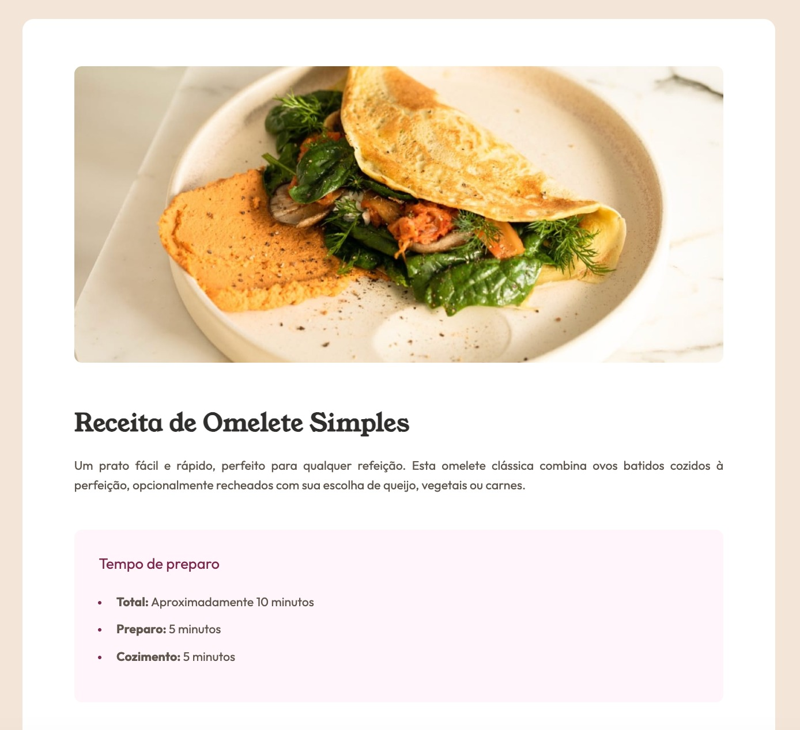

# Frontend Mentor - Solução para "Recipe page"

Esta é uma solução para o [Desafio da página de receitas](https://www.frontendmentor.io/challenges/recipe-page-KiTsR8QQKm) do Frontend Mentor.

## Índice

- [Visão geral](#visão-geral)
- [Links](#links)
- [O que aprendi](#o-que-aprendi)
- [Captura de tela](#captura-de-tela)

## Visão Geral

Esta é uma página de receita de uma omelete simples. Inclui uma imagem do prato, um breve resumo e o tempo estimado de preparo. Além disso, apresenta uma lista dos ingredientes e o modo de preparo, juntamente com uma tabela nutricional.
O projeto foi feito usando apenas HTML5 e CSS3.

## Links

- URL Site: [https://leeticia-araaujo.github.io/receita/receita/index.html](https://leeticia-araaujo.github.io/receita/receita/index.html)
- URL Repositório: [https://github.com/leeticia-araaujo/receita](https://github.com/leeticia-araaujo/receita) 

## O que aprendi

Durante a construção da página tive dificuldade em estilizar as listas, mudar a cor do marcador e mudar o espaçamento, a comunidade do [Frontend Mentor no discord](https://discord.com/channels/824970620529279006/1098552990035607563) me ajudou com a resolução desses problemas. 

## Captura de tela

